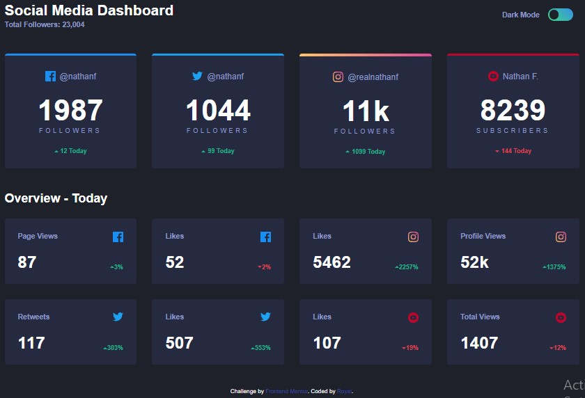
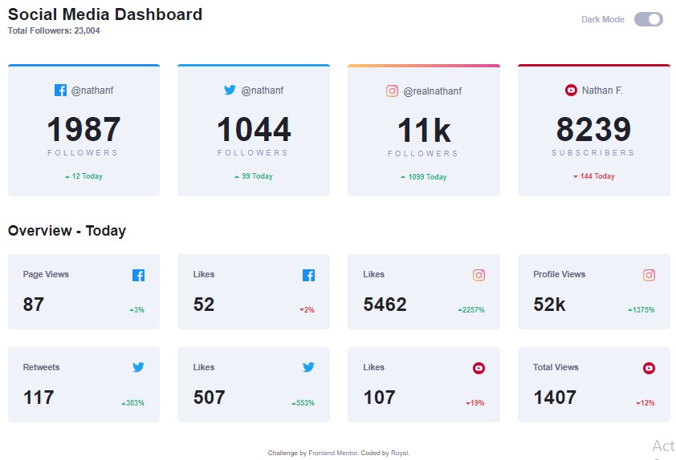

# Social media dashboard with theme switcher solution

This is a solution to the Social media dashboard with theme switcher challenge on Frontend Mentor (https://www.frontendmentor.io/challenges/social-media-dashboard-with-theme-switcher-6oY8ozp_H) 

## Table of contents

- [Overview]
- [Screenshot]
- [My process]
- [Built with]
- [What I learned]
- [Author]
- [Acknowledgments]

## Overview
This is simple, clean project showcasing a social media dashboard with the ability to change the color the both based on the toggle and the users system preference. It also ustilizes local storage for saving the previously use theme of the user. It is built with HTML, CSS(SCSS) and Vanilla Javascript. The project is broken into different files and components for easy readability. It use a mobile first approact to ensure responsiveness to various screen sizes. It is as well tracked using git. I is also built with accessibiltiy in mind.

### Screenshot




## My process
I started off with creating the directory  and intializing it with git,then created the various files and folders I required(HTML, CSS, JS etc). I continued with the HTML mark-up, then once that was through started styling with css (setting breakpoints, using custom propertices, grid, flexbox etc.) then I finish it up with writing the javascript for the functionality of the toggle.

### Built with

- Semantic HTML5 markup
- CSS custom properties
- Flexbox
- CSS Grid
- Mobile-first workflow
-Javascript


### What I learned
I learnt a lot along the way of building this project from sass function to properly utilizing localStorage to change color theme based on user prefrences etc. And below are just a few code snippets I am proud of from this project.

```scss
// 640px, 1150px, 1440px
$breakpoints-up:(
     'medium': '40em',
     'large': '71.875em',
     'xlarge': '87.5em',
);

//639px, 1149px, 1399px
$breakpoints-down:(
     'small': '39.9375em',
     'medium': '71.8125em',
     'large': '87.4375em',
);

@mixin breakpoint ($size){
     @media (min-width: map-get($breakpoints-up, $size)) {
          @content;
     }
}

@mixin breakpoint-down($size){
     @media (max-width: map-get($breakpoints-down, size)) {
          @content;
          
     }
}
```
```js
function checkMode(){
    if(localStorage.getItem("colorMode") == null){
      if(window.matchMedia('(prefers-color-scheme: light)').matches){
             lightToggle.click();
          }
          else if (window.matchMedia('(prefers-color-scheme: dark)').matches) {
               darkToggle.click();
          }
     }
}
```

## Author
- Frontend Mentor - [@royal334](https://www.frontendmentor.io/profile/royal334)
- Twitter - [@SamOtuonye](https://www.twitter.com/SamOtuonye)

## Acknowledgments
I had a lot of online help building this project especially from youtube from 
https://www.youtube.com/@TheCoderCoder,
https://www.youtube.com/@KevinPowell and
https://www.youtube.com/@freecodecamp


